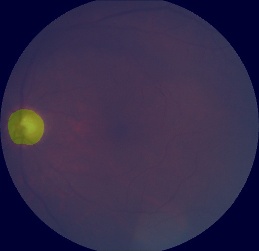

<<<<<<< HEAD
English | [简体中文](api_example_cn.md)

# API Tutorial

Through this tutorial, you will quickly learn the API calls of PaddleSeg, and easily train, evaluate and predict semantic segmentation models. We will take BiSeNetV2 and optic disc segmentation datasets as examples to teach you step by step how to call the API to build models, datasets, loss functions, optimizers and other modules.

If you are more interested in the configuration call method, you can refer to the [tutorial](https://aistudio.baidu.com/aistudio/projectdetail/1672610).

**Note**：Please fork the latest version of this project on AI studio, and then run it.

**Note**：For more details of PaddleSeg API，please refer to the [tutorial](https://github.com/PaddlePaddle/PaddleSeg/tree/develop/docs/apis).

## Installation 
=======
# API应用案例

通过本教程，你将快速学会PaddleSeg的API调用，轻松进行语义分割模型的训练、评估和预测。我们将以BiSeNetV2和视盘分割数据集为例一步一步的教导你如何调用API进行模型、数据集、损失函数、优化器等模块的构建。

如果对配置化调用方式更感兴趣，可参考[10分钟上手PaddleSeg](https://aistudio.baidu.com/aistudio/projectdetail/1672610)教程。

**Note**：请在AI studio上fork本项目的最新版本，然后运行使用。

**Note**：若想更详细地了解PaddleSeg API，请阅读[API文档](https://github.com/PaddlePaddle/PaddleSeg/tree/develop/docs/apis)

## PaddleSeg安装及环境配置
>>>>>>> 9c8570af (add new models)

```python
!pip install paddleseg
```

<<<<<<< HEAD
## Model Training

### 1. Bulid the model
=======
## 模型训练

### 1. 构建模型
>>>>>>> 9c8570af (add new models)

```python
from paddleseg.models import BiSeNetV2
model = BiSeNetV2(num_classes=2,
                 lambd=0.25,
                 align_corners=False,
                 pretrained=None)
```

<<<<<<< HEAD
### 2. Build train dataset

```python
# bulid transforms for training
=======
### 2. 构建训练集

```python
# 构建训练用的transforms
>>>>>>> 9c8570af (add new models)
import paddleseg.transforms as T
transforms = [
    T.Resize(target_size=(512, 512)),
    T.RandomHorizontalFlip(),
    T.Normalize()
]

<<<<<<< HEAD
# bulid train dataset
=======
# 构建训练集
>>>>>>> 9c8570af (add new models)
from paddleseg.datasets import OpticDiscSeg
train_dataset = OpticDiscSeg(
    dataset_root='data/optic_disc_seg',
    transforms=transforms,
    mode='train'
)
```

<<<<<<< HEAD
### 3. Bulid validation dataset

```python
# bulid transforms for validation
=======
### 3. 构建验证集

```python
# 构建验证用的transforms
>>>>>>> 9c8570af (add new models)
import paddleseg.transforms as T
transforms = [
    T.Resize(target_size=(512, 512)),
    T.Normalize()
]

<<<<<<< HEAD
# bulid validation dataset
=======
# 构建验证集
>>>>>>> 9c8570af (add new models)
from paddleseg.datasets import OpticDiscSeg
val_dataset = OpticDiscSeg(
    dataset_root='data/optic_disc_seg',
    transforms=transforms,
    mode='val'
)
```

<<<<<<< HEAD
### 4. Optimizer

```python
import paddle
# set learning rate
=======
### 4. 构建优化器

```python
import paddle
# 设置学习率
>>>>>>> 9c8570af (add new models)
base_lr = 0.01
lr = paddle.optimizer.lr.PolynomialDecay(base_lr, power=0.9, decay_steps=1000, end_lr=0)

optimizer = paddle.optimizer.Momentum(lr, parameters=model.parameters(), momentum=0.9, weight_decay=4.0e-5)
```

<<<<<<< HEAD
### 5. Loss function

To accommodate multi-pass loss, the loss function should be built as a dict containing 'types' and 'coef' as shown below. where losses['type'] represents the loss function type, and losses['coef'] is the corresponding coefficient. Note that len(losses['types']) should be equal to len(losses['coef']).
=======
### 5. 构建损失函数

为了适应多路损失，损失函数应构建成包含'types'和'coef'的dict，如下所示。 其中losses['type']表示损失函数类型， losses['coef']为对应的系数。需注意len(losses['types'])应等于len(losses['coef'])。
>>>>>>> 9c8570af (add new models)

```python
from paddleseg.models.losses import CrossEntropyLoss
losses = {}
losses['types'] = [CrossEntropyLoss()] * 5
losses['coef'] = [1]* 5
```

<<<<<<< HEAD
### 6.Train
=======
### 6.训练
>>>>>>> 9c8570af (add new models)

```python
from paddleseg.core import train
train(
    model=model,
    train_dataset=train_dataset,
    val_dataset=val_dataset,
    optimizer=optimizer,
    save_dir='output',
    iters=1000,
    batch_size=4,
    save_interval=200,
    log_iters=10,
    num_workers=0,
    losses=losses,
    use_vdl=True)
```

<<<<<<< HEAD
## Model Evaluation

### 1. Bulid model
=======
## 模型评估

### 1. 构建模型
>>>>>>> 9c8570af (add new models)

```python
from paddleseg.models import BiSeNetV2
model = BiSeNetV2(num_classes=2,
                 lambd=0.25,
                 align_corners=False,
                 pretrained=None)
```

<<<<<<< HEAD
### 2. Load pretrained model
=======
### 2. 加载模型参数
>>>>>>> 9c8570af (add new models)

```python
model_path = 'output/best_model/model.pdparams'
if model_path:
    para_state_dict = paddle.load(model_path)
    model.set_dict(para_state_dict)
    print('Loaded trained params of model successfully')
else:
    raise ValueError('The model_path is wrong: {}'.format(model_path))
```

<<<<<<< HEAD
### 3. Bulid validation dataset

```python
# config transforms for validation
=======
### 3. 构建验证集

```python
# 构建验证用的transforms
>>>>>>> 9c8570af (add new models)
import paddleseg.transforms as T
transforms = [
    T.Resize(target_size=(512, 512)),
    T.Normalize()
]

<<<<<<< HEAD
# bulid validation dataset
=======
# 构建验证集
>>>>>>> 9c8570af (add new models)
from paddleseg.datasets import OpticDiscSeg
val_dataset = OpticDiscSeg(
    dataset_root='data/optic_disc_seg',
    transforms=transforms,
    mode='val'
)
```

<<<<<<< HEAD
### 4. Evaluation
=======
### 4. 评估
>>>>>>> 9c8570af (add new models)

```python
from paddleseg.core import evaluate
evaluate(
        model,
        val_dataset)
```

<<<<<<< HEAD
### 5. Multi-scale + flip evaluation
=======
### 5. 多尺度+翻转评估
>>>>>>> 9c8570af (add new models)

```python
evaluate(
        model,
        val_dataset,
        aug_eval=True,
        scales=[0.75, 1.0, 1.25],
        flip_horizontal=True)
```

<<<<<<< HEAD
## Visualization

### 1. Bulid model
=======
## 效果可视化

### 1. 构建模型
>>>>>>> 9c8570af (add new models)

```python
from paddleseg.models import BiSeNetV2
model = BiSeNetV2(num_classes=2,
                 lambd=0.25,
                 align_corners=False,
                 pretrained=None)
```

<<<<<<< HEAD
### 2. Config transform
=======
### 2. 创建transform
>>>>>>> 9c8570af (add new models)

```python
import paddleseg.transforms as T
transforms = T.Compose([
    T.Resize(target_size=(512, 512)),
    T.RandomHorizontalFlip(),
    T.Normalize()
])
```

<<<<<<< HEAD
### 3. Build a list of images to predict
=======
### 3. 构建待预测的图像列表
>>>>>>> 9c8570af (add new models)

```python
import os
def get_image_list(image_path):
    """Get image list"""
    valid_suffix = [
        '.JPEG', '.jpeg', '.JPG', '.jpg', '.BMP', '.bmp', '.PNG', '.png'
    ]
    image_list = []
    image_dir = None
    if os.path.isfile(image_path):
        if os.path.splitext(image_path)[-1] in valid_suffix:
            image_list.append(image_path)
    elif os.path.isdir(image_path):
        image_dir = image_path
        for root, dirs, files in os.walk(image_path):
            for f in files:
                if os.path.splitext(f)[-1] in valid_suffix:
                    image_list.append(os.path.join(root, f))
    else:
        raise FileNotFoundError(
            '`--image_path` is not found. it should be an image file or a directory including images'
        )

    if len(image_list) == 0:
        raise RuntimeError('There are not image file in `--image_path`')

    return image_list, image_dir
<<<<<<< HEAD
image_path = 'data/optic_disc_seg/JPEGImages/N0010.jpg' # You can also enter a directory containing images
image_list, image_dir = get_image_list('data/optic_disc_seg/JPEGImages/N0010.jpg')
```

### 4. Prediction

The image prediction result will be output to the save path `save_dir`. Two directories will be generated under this path. `pseudo_color_prediction` saves the pseudo-color prediction result graph, you can directly view the prediction effect of each category, and `added_prediction` saves the pseudo-color prediction result and the superimposed effect graph of the original image.
=======
image_path = 'data/optic_disc_seg/JPEGImages/N0010.jpg' # 也可以输入一个包含图像的目录
image_list, image_dir = get_image_list('data/optic_disc_seg/JPEGImages/N0010.jpg')
```

### 4. 预测

图片预测结果将会输出到保存路径`save_dir`当中。该路径下将生成2个目录，`pseudo_color_prediction`保存伪彩色预测结果图，可直接查看各个类别的预测效果，`added_prediction`保存伪彩色预测结果和原图的叠加效果图。
>>>>>>> 9c8570af (add new models)

```python
from paddleseg.core import predict
predict(
        model,
        model_path='output/best_model/model.pdparams',
        transforms=transforms,
        image_list=image_list,
        image_dir=image_dir,
        save_dir='output/results'
    )
```

<<<<<<< HEAD
The predicted effect is as follows:

- False Color Prediction Results


- overlay effect
=======
预测效果如下：

- 伪彩色预测结果


- 叠加效果
>>>>>>> 9c8570af (add new models)


