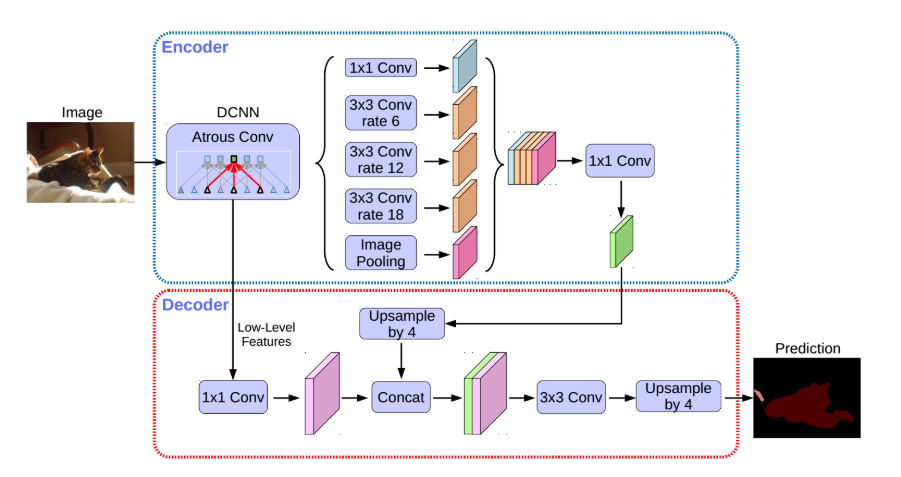

# DeepLab V3+
<<<<<<< HEAD
### **Principle**

For the currently very popular real-time segmentation scenarios, such as the short video field and the live broadcast field, real-time segmentation algorithms are required, which requires our algorithms to be lightweight enough. So what does a good segmentation model network look like? First, let's take a look at the structure of a common segmentation network. The output of a segmentation network is a probability map of N * H * W, where N is a vector, and the dimension of the vector is expressed as the number of categories, that is, each element of the vector corresponds to a category, and this The numeric value of the element is the probability value, expressed as the probability corresponding to the class. Because each pixel category is given, the size of H * W needs to be consistent with the original image. The segmentation network can be regarded as a fully convolutional network without a fully connected layer. The common network structure can be divided into two parts: Encoder and Decoder:

- The length and width of the feature map of the Encoder part will gradually shrink, that is, downsampling is required.
- The length and width of the decoder part of the feature map will gradually increase, that is, upsampling is required.

What problems does a good segmentation network need to solve? The first question is how to obtain a larger receptive field by using fewer Encoder layers. First, let's look at what a receptive field is. The value of each point on the output feature map is obtained by multiplying the elements of the area of size k_h * k_w on the input image with each element of the convolution kernel, therefore, the change of the value of each element in the k_h * k_w area of the input image will affect the pixel value of the output point. We call this region the receptive field of the corresponding point on the output feature map. The change in the value of each pixel in the perception field will affect the value change of the output point. Therefore, the receptive field can also be expressed as the size of the image area affected by each point on the feature map. The size of the receptive field is an important evaluation metric for the feature representation ability of the segmentation network, because we want to increase the size of the receptive field as much as possible. The most direct method is to increase the number of layers of the Encoder network, but this method will bring some drawbacks while expanding the receptive field, such as increasing the scale of network parameters, resulting in increased training time. So is there a better way?

By expanding the reachable area of the convolution kernel, the receptive field is enlarged, and the range of information contained in the convolution is expanded. As shown in the figure below, the figure is a schematic diagram of the effect of hole convolution. It can be seen that the network without atrous convolution, an output dark blue point can cover 5 input pixels. After using atrous convolution, one output point can cover the points of 9 input pixels. For specific application examples, please refer to the network structure of DeepLabv3+.

The second problem that the segmentation network needs to face is that the length and width of the features are constantly decreasing during the downsampling process. Although we obtain high-order features, the dimensions are small. If it is directly used as an upsampling input, some information may be lost. How to solve this problem? In this case, the skip connection function can be used. Through skip connections, the upsampling process can use not only high-order features, but also low-order features of the same dimension. For specific usage examples, see the introduction to the U-Net model in Basic Principles.

In addition to the above two problems, the segmentation network also needs to solve the multi-scale problem. The multi-scale problem refers to the size of the target in the same image. How to ensure that targets of different scales can be handled well? The ASPP network structure can be used here. In layman's terms, the realization idea is to let the targets of different scales be processed by the convolutional layers of different receptive fields, the large receptive field handles the big target, and the small receptive field handles the small target. For specific application examples, please refer to the network structure of DeepLabv3+ below.

### DeepLabv3+

DeepLabv3+ is the last version in the DeepLab series, with its predecessors DeepLabv1, DeepLabv2 and DeepLabv3. In the latest work, the author combines the advantages of the encoder-decoder structure and the Spatial Pyramid Pooling (SPP) module to propose a new semantic segmentation network DeepLabv3+, on the PASCAL VOC 2012 and Cityscapes datasets Get new state-of-art performance.
The overall structure is shown below. The main body of the Encoder is the backbone network with atrous convolution (Atrous Convolution). The backbone network can use commonly used classification networks such as ResNet. The author uses the improved Xception model as the backbone network. The following Atrous Spatial Pyramid Pooling (ASPP) module introduces multi-scale information. Compared with the previous work DeepLabv3, DeepLabv3+ adds a decoder module to further integrate shallow features and deep features to optimize the segmentation effect, especially the effect of the target edge. In addition, the author applies Depthwise Separable Convolution to ASPP and Decoder modules, which improves the robustness and running rate of semantic segmentation.

DeepLabv3+

For details, please refer to[Encoder-Decoder with Atrous Separable Convolution for Semantic Image Segmentation](https://arxiv.org/abs/1802.02611).
=======
### **基本原理**

对于当前十分流行的实时分割场景，例如短视频领域、直播领域，都需要实时分割算法，这就需要我们的算法足够轻量。那么一个好的分割模型网络是什么样子的呢？ 首先我们来看下常见的分割网络是什么样的结构。 一个分割网络的输出是一个$N\times H\times W$的概率图，其中N是一个向量，向量的维数表示为类别的数量，也就是说向量的每个元素对应一个类别，而这个元素的数值是概率值，表示为对应该类别的概率。因为要给出每一个像素类别，所以$H\times W$大小需要与原图保持一致。分割网络可以看作是一个没有全连接层的全卷积网络，常见的网络结构可以分为Encoder和Decoder两个部分：

- Encoder部分特征图的长宽会逐步缩小，也就是需要下采样。
- Decoder部分特征图的长宽会逐步增大，也就是需要上采样。

一个好的分割网络需要解决哪些问题？第一个问题就是如何通过较少Encoder层数来获得较大的感受野。首先来看下什么是感受野。输出特征图上每个点的数值，是由输入图片上大小为$k_h\times k_w$的区域的元素与卷积核每个元素相乘再相加得到的，所以输入图像上$k_h\times k_w$区域内每个元素数值的改变，都会影响输出点的像素值。我们将这个区域叫做输出特征图上对应点的感受野。感受野内每个像素数值的变动，都会影响输出点的数值变化。因此感受野也可以表示为特征图上每个点所受图像区域范围影响的大小。感受野的大小是分割网络的特征表示能力的一个重要评价指标，因为我们希望尽可能提高感受野的大小。最直接的方法就是提高Encoder网络的层数，但是这种方法会在扩大感受野的同时，带来一些弊端，例如增加了网络参数规模，导致训练耗时增加。那么有没有更好的方法呢？

通过扩大卷积核可触达的区域来增大感受野，扩大卷积所包含的信息范围。如下图所示，该图为空洞卷积作用的示意图示意图。可以看到未使用空洞卷积的网络，一个输出的深蓝色的点可以覆盖5个输入像素点。在使用空洞卷积之后，一个输出点可以覆盖9个输入像素的点。其具体应用示例可以参见DeepLabv3+的网络结构。

分割网络需要面临的第二个问题是下采样过程中特征的长和宽在不断减少，我们虽然得到了高阶特征，但是维度较小，如果直接作为上采样输入，则有可能丢失一部分信息，怎么解决这个问题呢？这时可以使用跳跃连接功能。通过跳跃连接，使上采样过程不仅使用高阶特征，也可以使用同维度的低阶特征，具体使用示例可以参见基本原理中的U-Net模型介绍。

除了上述两个问题之外，分割网络还需要解决多尺度问题，多尺度问题是指同一个图片中目标有大有小，如何保证不同尺度的目标均能被很好的处理呢？这里可以使用ASPP网络结构，通俗的讲，其实现思想是让不同尺度的目标交给不同感受野的卷积层来处理，大感受野处理大目标，小感受野处理小目标。其具体应用示例可以参见下面DeepLabv3+的网络结构。

### DeepLabv3+

DeepLabv3+是DeepLab系列的最后一篇文章，其前作有DeepLabv1、DeepLabv2和DeepLabv3。在最新作中，作者结合编码器-解码器(encoder-decoder)结构和空间金字塔池化模块(Spatial Pyramid Pooling, SPP)的优点提出新的语义分割网络DeepLabv3+，在 PASCAL VOC 2012和Cityscapes数据集上取得新的state-of-art performance.
其整体结构如下所示，Encoder的主体是带有空洞卷积(Atrous Convolution)的骨干网络，骨干网络可采用ResNet等常用的分类网络，作者使用了改进的Xception模型作为骨干网络。紧跟其后的空洞空间金字塔池化模块(Atrous Spatial Pyramid Pooling, ASPP)则引入了多尺度信息。相比前作DeepLabv3，DeepLabv3+加入decoder模块，将浅层特征和深层特征进一步融合，优化分割效果，尤其是目标边缘的效果。此外，作者将深度可分离卷积(Depthwise Separable Convolution)应用到ASPP和Decoder模块，提高了语义分割的健壮性和运行速率。

DeepLabv3+结构图

具体原理细节请参考[Encoder-Decoder with Atrous Separable Convolution for Semantic Image Segmentation](https://arxiv.org/abs/1802.02611)。
>>>>>>> 9c8570af (add new models)
