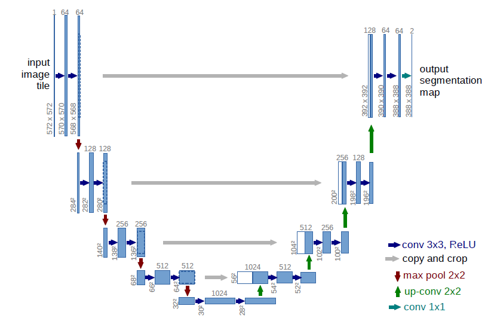

# U-Net

<<<<<<< HEAD
U-Net [1] originated from medical image segmentation, and has the characteristics of few parameters, fast calculation, strong applicability, and high adaptability to general scenes. U-Net was first proposed in 2015 and won the first place in the ISBI 2015 Cell Tracking Challenge. After development, there are currently several variants and applications. The structure of the original U-Net is a standard encoder-decoder structure. As shown in the figure below, the left side can be regarded as an encoder, and the right side can be regarded as a decoder. The encoder consists of four sub-modules, each sub-module contains two convolutional layers, and each sub-module is then downsampled by the max pool. The encoder as a whole presents a gradually shrinking structure, continuously reducing the spatial dimension of the pooling layer and reducing the resolution of the feature map to capture contextual information.
The decoder presents a symmetrical expansion structure with the encoder, and gradually repairs the details and spatial dimensions of the segmented objects to achieve precise positioning. The decoder also includes four sub-modules, and the resolution is sequentially increased through the upsampling operation until it is basically the same as the resolution of the input image.
The network also uses skip connections, that is, every time the decoder upsamples, the feature maps corresponding to the same resolution in the decoder and encoder are fused in a spliced ​​manner to help the decoder better recover the details of the target. Because the overall structure of the network is similar to the capital letter U, it is named U-Net.

U-Net

For details, please refer to[U-Net:Convolutional Networks for Biomedical Image Segmentation](https://arxiv.org/abs/1505.04597).
=======
U-Net [1] 起源于医疗图像分割，具有参数少、计算快、应用性强的特点，对于一般场景适应度很高。U-Net最早于2015年提出，并在ISBI 2015 Cell Tracking Challenge取得了第一。经过发展，目前有多个变形和应用。
原始U-Net的结构是标准的编码器-解码器结构。如下图所示，左侧可视为一个编码器，右侧可视为一个解码器。编码器由四个子模块组成，每个子模块包含两个卷积层，每个子模块之后又通过max pool进行下采样。编码器整体呈现逐渐缩小的结构，不断减少池化层的空间维度，缩小特征图的分辨率，以捕获上下文信息。
解码器呈现与编码器对称的扩张结构，逐步修复分割对象的细节和空间维度，实现精准的定位。解码器同样也包含四个子模块，分辨率通过上采样操作依次增大，直到与输入图像的分辨率基本一致。
该网络还使用了跳跃连接，即解码器每上采样一次，就以拼接的方式将解码器和编码器中对应相同分辨率的特征图进行特征融合，帮助解码器更好地恢复目标的细节。由于网络整体结构类似于大写的英文字母U，故得名U-Net。

U-Net结构图

具体原理细节请参考[U-Net:Convolutional Networks for Biomedical Image Segmentation](https://arxiv.org/abs/1505.04597)。
>>>>>>> 9c8570af (add new models)
