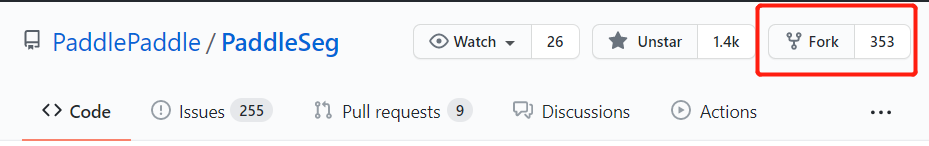
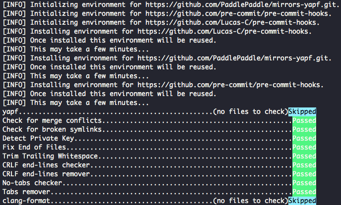
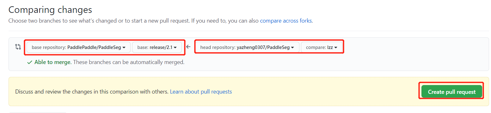

<<<<<<< HEAD
English|[简体中文](pr_cn.md)
# PaddleSeg code submission process and specifications

## 1. Fork and clone code

* Jump to [PaddleSeg GitHub home page](https://github.com/PaddlePaddle/PaddleSeg), and then click the fork button to generate a repository in your own directory, such as `https://github.com/USERNAME/PaddleSeg` .
=======
# PaddleSeg代码提交流程与规范

#### 1 fork和clone代码

* 跳转到[PaddleSeg GitHub首页](https://github.com/PaddlePaddle/PaddleSeg)，然后单击 Fork 按钮，生成自己目录下的仓库，比如 `https://github.com/USERNAME/PaddleSeg`。
>>>>>>> 9c8570af (add new models)

  


<<<<<<< HEAD
* Clone the remote repository to the local.

    ```shell
    # Pull the code of the develop branch
    git clone https://github.com/USERNAME/PaddleSeg.git -b develop
    cd PaddleSeg
    ```

The address of clone can be obtained from below:

   


## 2. Establish a connection with the remote repository

First check the information of the current remote repository through `git remote -v`.

```
origin https://github.com/USERNAME/PaddleSeg.git (fetch)
origin https://github.com/USERNAME/PaddleSeg.git (push)
```

It only shows the information of the forked remote repository, which is PaddleSeg under the user name. Next, we will create a remote connection to the original PaddleSeg repository and name it upstream.
=======


* 将远程仓库clone到本地

```shell
# 拉取develop分支的代码
git clone https://github.com/USERNAME/PaddleSeg.git -b develop
cd PaddleSeg
```

clone的地址可以从下面获取


#### 2 和远程仓库建立连接

首先通过`git remote -v`查看当前远程仓库的信息。

```
origin    https://github.com/USERNAME/PaddleSeg.git (fetch)
origin    https://github.com/USERNAME/PaddleSeg.git (push)
```

只有clone的远程仓库的信息，也就是自己用户名下的 PaddleSeg，接下来我们创建一个原始 PaddleSeg仓库的远程主机，命名为 upstream。
>>>>>>> 9c8570af (add new models)

```shell
git remote add upstream https://github.com/PaddlePaddle/PaddleSeg.git
```

<<<<<<< HEAD
Use `git remote -v` to view the information of the current remote repository. The output is as follows. There are two remote repositories, which includes origin and upstream.

```
origin https://github.com/USERNAME/PaddleSeg.git (fetch)
origin https://github.com/USERNAME/PaddleSeg.git (push)
upstream https://github.com/PaddlePaddle/PaddleSeg.git (fetch)
upstream https://github.com/PaddlePaddle/PaddleSeg.git (push)
```

It can be used to keep the local repository up to date with the original repo when submitting a pull request (PR) in the future.

## 3. Create a local branch

You can create a new local branch based on the current branch, the command is as follows:
=======
使用`git remote -v`查看当前远程仓库的信息，输出如下，发现包括了origin和upstream 2个远程仓库。

```
origin    https://github.com/USERNAME/PaddleSeg.git (fetch)
origin    https://github.com/USERNAME/PaddleSeg.git (push)
upstream    https://github.com/PaddlePaddle/PaddleSeg.git (fetch)
upstream    https://github.com/PaddlePaddle/PaddleSeg.git (push)
```

这主要是为了后续在提交pull request(PR)时，始终保持本地仓库最新。

#### 3 创建本地分支

可以基于当前分支创建新的本地分支，命令如下。
>>>>>>> 9c8570af (add new models)

```shell
git checkout -b new_branch
```

<<<<<<< HEAD
You can also create a new branch based on a remote or upstream branch, the command is as follows:

```shell
# Create a new_branch branch based on the develop of the user's remote repository (origin)
git checkout -b new_branch origin/develop
# Create a new_branch branch based on the develop of the upstream remote repository (upstream)
# If you need to create a new branch from upstream, you need to use git fetch upstream to get the upstream code first
git checkout -b new_branch upstream/develop
```

Eventually the git repo will switch to the new branch, the output information is as follows:

```
Branch new_branch set up to track remote branch develop from upstream.
Switched to a new branch'new_branch'
```

## 4. Use pre-commit hook

Paddle developers use the pre-commit tool to manage Git pre-commit hooks. It can help us format the source code (C++, Python), and automatically check some basic rules before commit (for example, there is only one EOL for each file, don't add large files in Git, etc.).

The pre-commit test is part of the unit test in Travis-CI. PRs that do not satisfy the hook cannot be submitted to PaddleSeg. First install and run it in the current directory:
=======
也可以基于远程或者上游的分支创建新的分支，命令如下。

```shell
# 基于用户远程仓库(origin)的develop创建new_branch分支
git checkout -b new_branch origin/develop
# 基于上游远程仓库(upstream)的develop创建new_branch分支
# 如果需要从upstream创建新的分支，需要首先使用git fetch upstream获取上游代码
git checkout -b new_branch upstream/develop
```

最终会显示切换到新的分支，输出信息如下

```
Branch new_branch set up to track remote branch develop from upstream.
Switched to a new branch 'new_branch'
```

#### 4 使用pre-commit勾子

Paddle 开发人员使用 pre-commit 工具来管理 Git 预提交钩子。 它可以帮助我们格式化源代码（C++，Python），在提交（commit）前自动检查一些基本事宜（如每个文件只有一个 EOL，Git 中不要添加大文件等）。

pre-commit测试是 Travis-CI 中单元测试的一部分，不满足钩子的 PR 不能被提交到 PaddleSeg，首先安装并在当前目录运行它：
>>>>>>> 9c8570af (add new models)

```shell
pip install pre-commit
pre-commit install
```

<<<<<<< HEAD
* **Notice**
1. Paddle uses clang-format to adjust the C/C++ source code format, please make sure the `clang-format` version is above 3.8.
2. The yapf installed by `pip install pre-commit` and `conda install -c conda-forge pre-commit` is slightly different. PaddleSeg developers use `pip install pre-commit`.

## 5. Modify and submit code

You can view the changed files through `git status`.if you made changes to the `README.md` of PaddleSeg, and hope to submit it. You can go through the following steps:
=======
* **注意**
1. Paddle 使用 clang-format 来调整 C/C++ 源代码格式，请确保 `clang-format` 版本在 3.8 以上。
2. 通过pip install pre-commit和conda install -c conda-forge pre-commit安装的yapf稍有不同的，PaddleSeg开发人员使用的是`pip install pre-commit`。

#### 5 修改与提交代码

可以通过`git status`查看改动的文件。
对PaddleSeg的`README.md`做了一些修改，希望提交上去。则可以通过以下步骤
>>>>>>> 9c8570af (add new models)

```shell
git add README.md
pre-commit
```

<<<<<<< HEAD
Repeat the above steps until the pre-comit format check does not report an error as follows:
=======
重复上述步骤，直到pre-comit格式检查不报错。如下所示。
>>>>>>> 9c8570af (add new models)




<<<<<<< HEAD
Use the following command to complete the submission.
=======
使用下面的命令完成提交。
>>>>>>> 9c8570af (add new models)

```shell
git commit -m "your commit info"
```

<<<<<<< HEAD
## 6. Keep the local repository up to date

Get the latest code from upstream and update the current branch. The upstream here comes from the section `Establishing a connection with a remote repository` in Section 2.

```shell
git fetch upstream
# If you want to submit to other branches, you need to pull the code from other branches of upstream, here is develop
git pull upstream develop
```

## 7. push to remote repository
=======
#### 6 保持本地仓库最新

获取 upstream 的最新代码并更新当前分支。这里的upstream来自于2节的`和远程仓库建立连接`部分。

```shell
git fetch upstream
# 如果是希望提交到其他分支，则需要从upstream的其他分支pull代码，这里是develop
git pull upstream develop
```

#### 7 push到远程仓库
>>>>>>> 9c8570af (add new models)

```shell
git push origin new_branch
```

<<<<<<< HEAD
## 8. Submit a Pull Request

Click new pull request, select the local branch and target branch, as shown in the figure below. In the description of the PR, fill in the functions completed by the PR. Next, wait for the review. If there is any need to modify, follow the steps above to update the corresponding branch in origin.
=======
#### 8 提交Pull Request

点击new pull request，选择本地分支和目标分支，如下图所示。在PR的描述说明中，填写该PR所完成的功能。接下来等待review，如果有需要修改的地方，参照上述步骤更新 origin 中的对应分支即可。
>>>>>>> 9c8570af (add new models)




<<<<<<< HEAD
## 9. Sign the CLA agreement and pass the unit test

* Sign the CLA
When submitting a Pull Request to PaddlePaddle for the first time, you need to sign a CLA (Contributor License Agreement) to ensure that your code can be incorporated. The specific signing method is as follows:

1. Please check the Check section in PR, find license/cla, and click on the detail on the right to enter the CLA website.
2. Click "Sign in with GitHub to agree" on the CLA website, and you will be redirected back to your Pull Request page after clicking Finish.

## 10. Delete branch

* Delete remote branch

After the PR is merged into the main repository, we can delete the branch of the remote repository on the PR page.

You can also use `git push origin :branch name` to delete remote branches, such as:
=======
#### 9 签署CLA协议和通过单元测试

* 签署CLA
在首次向PaddlePaddle提交Pull Request时，您需要您签署一次CLA(Contributor License Agreement)协议，以保证您的代码可以被合入，具体签署方式如下：

1. 请您查看PR中的Check部分，找到license/cla，并点击右侧detail，进入CLA网站
2. 点击CLA网站中的“Sign in with GitHub to agree”,点击完成后将会跳转回您的Pull Request页面

#### 10 删除分支

* 删除远程分支

在 PR 被 merge 进主仓库后，我们可以在 PR 的页面删除远程仓库的分支。

也可以使用 `git push origin :分支名` 删除远程分支，如：
>>>>>>> 9c8570af (add new models)


```shell
git push origin :new_branch
```

<<<<<<< HEAD
* Delete local branch

```shell
# Switch to the develop branch, otherwise the current branch cannot be deleted
git checkout develop

# Delete new_branch branch
git branch -D new_branch
```

## 11. Some conventions for submitting code

In order to make official maintainers focus on the code itself when reviewing the code, please abide by the following conventions every time you submit the code:

1) Please ensure that the unit tests in Travis-CI can pass smoothly. If not, it means that there is a problem with the submitted code, and the official maintainer generally does not review it.

2) Before submitting PUll Request:

Please pay attention to the number of commits.

Example: There are occasions when only one file is modified but more than a dozen commits are submitted, and each commit only makes a small amount of modification. These scienarios usaully cause great troubles for the reviewer. The reviewer needs to check each commit one by one to know what changes have been made, and it does not rule out that the changes between commits that covers each other.

Suggestion: Keep as few commits as possible whenever you commit, and you can use git commit --amend to supplement the last commit. For multiple commits that have been pushed to the remote repository, please refer to [squash commits after push](https://stackoverflow.com/questions/5667884/how-to-squash-commits-in-git-after-they-have-been-pushed).

Please pay attention to the name of each commit: it should reflect the content of the current commit.

1) If you solve a certain Issue, please add: fix #issue_number in the first comment box of the PUll Request, so that when the PUll Request is merged, the corresponding Issue will be closed automatically. Key words include: close, closes, closed, fix, fixes, fixed, resolve, resolves, resolved. Please select the appropriate vocabulary. For details, please refer to [Closing issues via commit messages](https://help.github.com/articles/closing-issues-via-commit-messages).

In addition, when responding to the reviewer’s comments, please abide by the following conventions:

1) Every review opinion of the official maintainer should be replied.

   - Give a simple Done if you agree to the review opinion and modify it according to it;
   - If you disagree with the review comments, please give your own reasons for refutation.

2) If there are more review opinions:

   - Please give the overall revision status.
   - Please use `start a review` to reply instead of replying directly. The reason is that every reply will send an e-mail, which will cause e-mail disaster.
=======
* 删除本地分支

```shell
# 切换到develop分支，否则无法删除当前分支
git checkout develop

# 删除new_branch分支
git branch -D new_branch
```

#### 11 提交代码的一些约定

为了使官方维护人员在评审代码时更好地专注于代码本身，请您每次提交代码时，遵守以下约定：

1）请保证Travis-CI 中单元测试能顺利通过。如果没过，说明提交的代码存在问题，官方维护人员一般不做评审。

2）提交PUll Request前：

请注意commit的数量。

原因：如果仅仅修改一个文件但提交了十几个commit，每个commit只做了少量的修改，这会给评审人带来很大困扰。评审人需要逐一查看每个commit才能知道做了哪些修改，且不排除commit之间的修改存在相互覆盖的情况。

建议：每次提交时，保持尽量少的commit，可以通过git commit --amend补充上次的commit。对已经Push到远程仓库的多个commit，可以参考[squash commits after push](https://stackoverflow.com/questions/5667884/how-to-squash-commits-in-git-after-they-have-been-pushed)。

请注意每个commit的名称：应能反映当前commit的内容，不能太随意。

3）如果解决了某个Issue的问题，请在该PUll Request的第一个评论框中加上：fix #issue_number，这样当该PUll Request被合并后，会自动关闭对应的Issue。关键词包括：close, closes, closed, fix, fixes, fixed, resolve, resolves, resolved，请选择合适的词汇。详细可参考[Closing issues via commit messages](https://help.github.com/articles/closing-issues-via-commit-messages)。

此外，在回复评审人意见时，请您遵守以下约定：

1）官方维护人员的每一个review意见都希望得到回复，这样会更好地提升开源社区的贡献。

- 对评审意见同意且按其修改完的，给个简单的Done即可；
- 对评审意见不同意的，请给出您自己的反驳理由。

2）如果评审意见比较多,

- 请给出总体的修改情况。
- 请采用`start a review`进行回复，而非直接回复的方式。原因是每个回复都会发送一封邮件，会造成邮件灾难。
>>>>>>> 9c8570af (add new models)
