

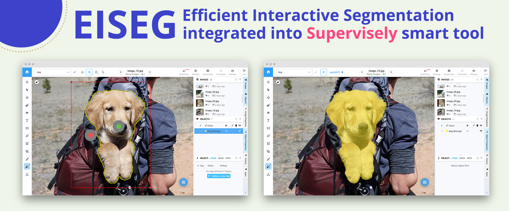

# Efficient Interactive Segmentation

  
<b>state-of-the art click-based interactive segmentation integrated into Supervisely Image Annotator</b>

  <a href="#Overview">Overview</a> •
  <a href="#How-to-run">How to run</a> •
  <a href="#How-to-use">How to use</a> •
  <a href="#Demo">Demo</a> •
  <a href="#Manual-object-correction">Manual object correction</a> •
  <a href="#Acknowledgment">Acknowledgment</a>

  

  

# Overview

**Application key points:**  
- Manually selected ROI
- Capability to correct prediction errors on the fly
- Select from [7 pretrained models](../EISeg/README_EN.md#model-preparation)
- Models are class agnostic you can segment any object from any industry

EISeg (Efficient Interactive Segmentation), built on [RITM](https://github.com/saic-vul/ritm_interactive_segmentation) and [EdgeFlow](https://arxiv.org/abs/2109.09406), is an efficient and intelligent interactive segmentation annotation software developed based on PaddlePaddle. It covers a large number of high-quality segmentation models in different directions such as general scenarios, portrait, remote sensing, medical treatment, etc., providing convenience to the rapid annotation of semantic and instance labels with reduced cost.

  
  

**Available pretrained models:**

| Model Type             | Applicable Scenarios                     | Model Architecture | Download Link                                                |
| ---------------------- | ---------------------------------------- | ------------------ | ------------------------------------------------------------ |
| High Performance Model | Image annotation in generic scenarios    | HRNet18_OCR64      | [static_hrnet18_ocr64_cocolvis](https://paddleseg.bj.bcebos.com/eiseg/0.4/static_hrnet18_ocr64_cocolvis.zip) |
| Lightweight Model      | Image annotation in generic scenarios    | HRNet18s_OCR48     | [static_hrnet18s_ocr48_cocolvis](https://paddleseg.bj.bcebos.com/eiseg/0.4/static_hrnet18s_ocr48_cocolvis.zip) |
| High Performance Model | Annotation in portrait scenarios         | HRNet18_OCR64      | [static_hrnet18_ocr64_human](https://paddleseg.bj.bcebos.com/eiseg/0.4/static_hrnet18_ocr64_human.zip) |
| Lightweight Model      | Annotation in portrait scenarios         | HRNet18s_OCR48     | [static_hrnet18s_ocr48_human](https://paddleseg.bj.bcebos.com/eiseg/0.4/static_hrnet18s_ocr48_human.zip) |
| High Performance Model | Image annotation in generic scenarios    | EdgeFlow           | [static_edgeflow_cocolvis](https://paddleseg.bj.bcebos.com/eiseg/0.4/static_edgeflow_cocolvis.zip) |
| Lightweight Model      | Annotation of remote sensing building    | HRNet18s_OCR48     | [static_hrnet18_ocr48_rsbuilding_instance](https://paddleseg.bj.bcebos.com/eiseg/0.4/static_hrnet18_ocr48_rsbuilding_instance.zip) |
| Lightweight Model      | Annotation of liver in medical scenarios | HRNet18s_OCR48     | [static_hrnet18s_ocr48_lits](https://paddleseg.bj.bcebos.com/eiseg/0.4/static_hrnet18s_ocr48_lits.zip) |

# How to run

### ⚠️ Notice  
 * The application may already be launched by the instance administrator (**Enterprise**) or the Supervisely team (**Community**). If the app is not available in dropdown menu in Labeling tool, please contact us. If the Smart Tool responds slowly, please run additional application sessions in your team.
 * **Enterprise only**: You can share started application with all users on your instance using **share** button in front of running session. We recommend to run multiple sessions if large number of users are using Smart Tool simultaneously.

---

1. Add [EISeg interactive segmentation SmartTool](https://ecosystem.supervise.ly/apps/PaddleSeg) to your team from Ecosystem.

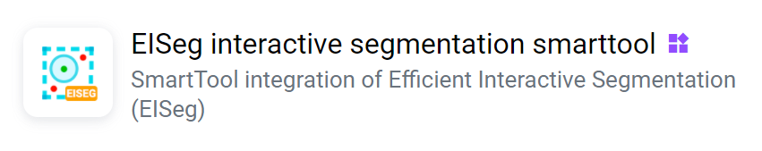  

2. Run app from **Plugins & Apps** page:

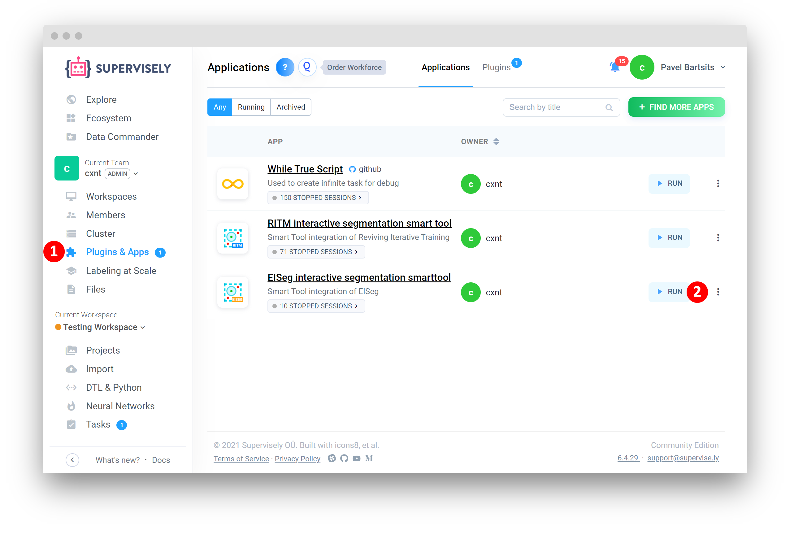

3. Select options in modal window and press the `Run` button.

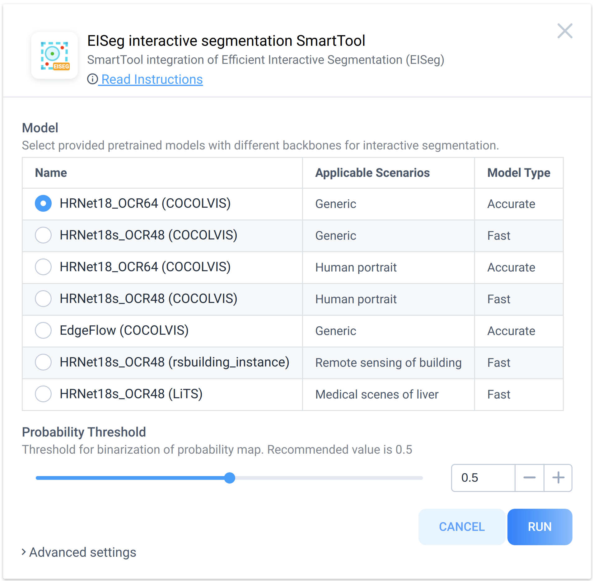

# How to use

<a data-key="sly-embeded-video-link" href="https://youtu.be/atYG2NQ_WCQ" data-video-code="atYG2NQ_WCQ"> 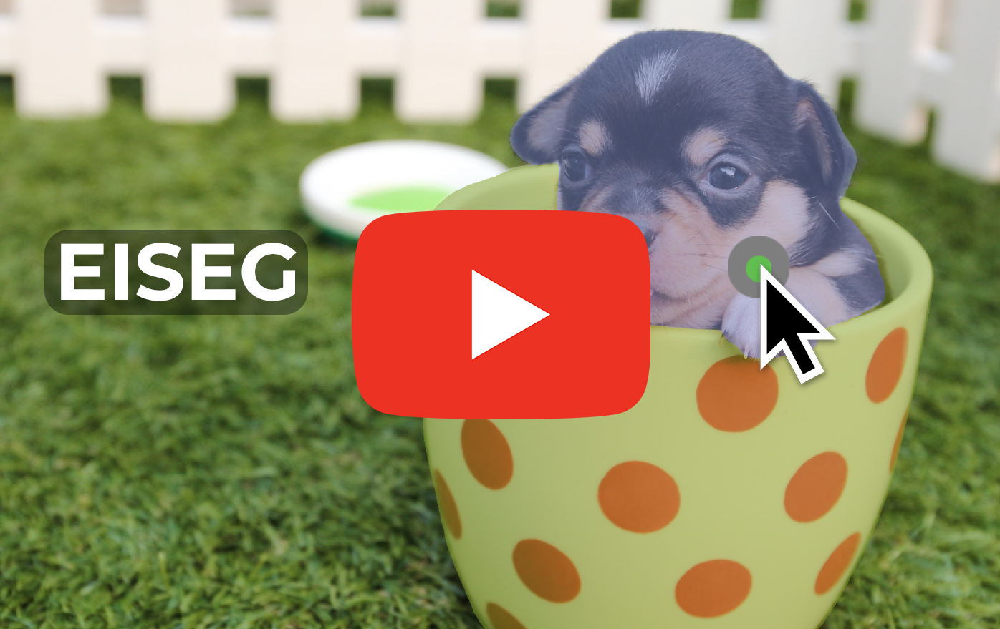 </a>  

## Controls

| Key                                                           | Description                               |
| ------------------------------------------------------------- | ------------------------------------------|
| <kbd>Left Mouse Button</kbd>                                  | Place a positive click                    |
| <kbd>Right Mouse Button</kbd>                                 | Place a negative click                    |
| <kbd>Scroll Wheel</kbd>                                       | Zoom an image in and out                  |
| <kbd>Right Mouse Button</kbd> +   <kbd>Move Mouse</kbd>    | Move an image                             |
| <kbd>Space</kbd>                                              | Finish the current object mask            |
| <kbd>Shift + H</kbd>                                          | Higlight instances with random colors     |
| <kbd>Ctrl + H</kbd>                                           | Hide all labels                           |

 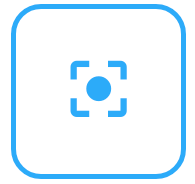 <b>—</b> Auto add positivie point to rectangle button (<b>ON</b> by default for SmartTool apps) 

 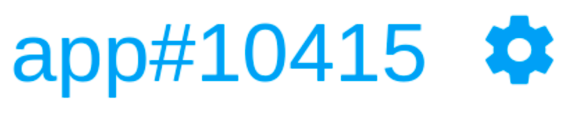 <b>—</b> SmartTool selector button, switch between SmartTool apps and models

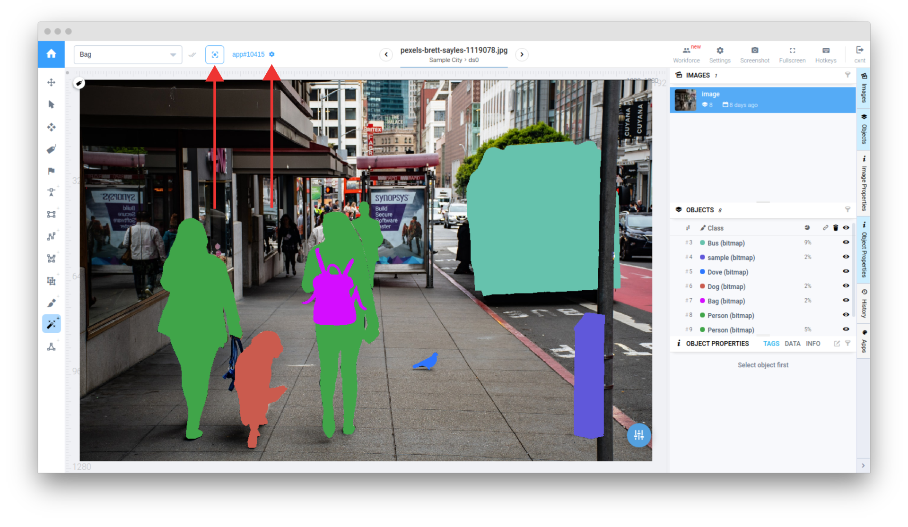

# Demo

**We have prepared a videos and demonstrated how EISEG works for the different domains:**

## Generic  
  <table>
    <tr style="width: 100%">
      <td>
        <a data-key="sly-embeded-video-link" href="https://youtu.be/5t8cQOvaknE" data-video-code="5t8cQOvaknE">     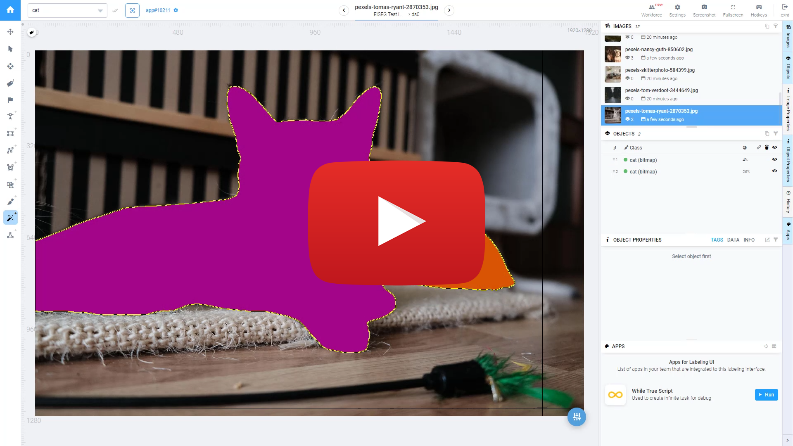 </a> 
      </td>
      <td>
        <a data-key="sly-embeded-video-link" href="https://youtu.be/ImlaIwX9-nE" data-video-code="ImlaIwX9-nE"> 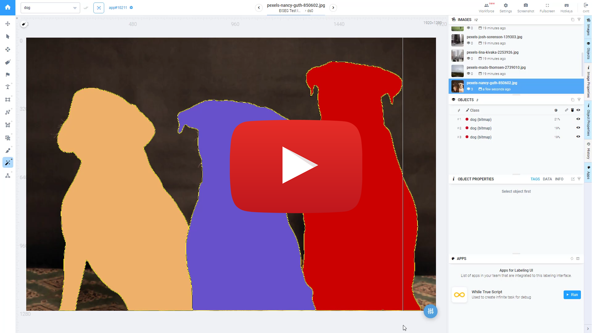 </a> 
      </td>
      </tr>
      <tr style="width: 100%">
        <td>
          <a data-key="sly-embeded-video-link" href="https://youtu.be/hoXB1m8qHJM" data-video-code="hoXB1m8qHJM">     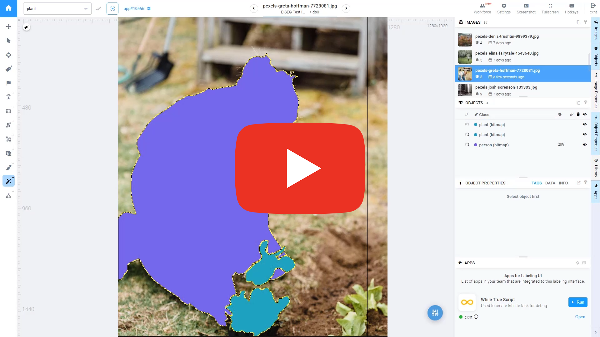 </a> 
        </td>
        <td>
          <a data-key="sly-embeded-video-link" href="https://youtu.be/cBp6-VPdKQA" data-video-code="cBp6-VPdKQA"> 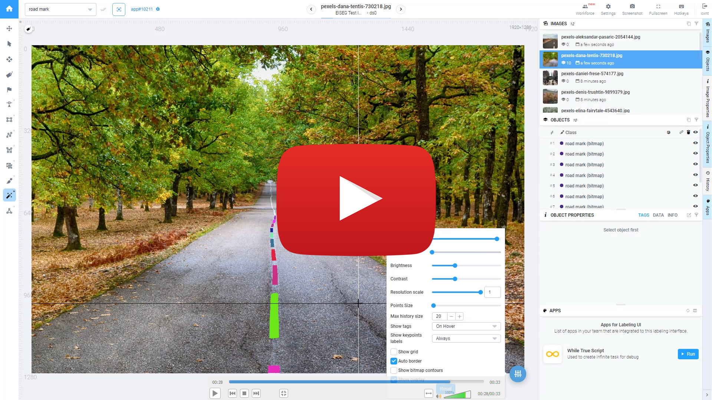 </a> 
        </td> 
      </tr>
      <tr style="width: 100%">  
        <td>
          <a data-key="sly-embeded-video-link" href="https://youtu.be/uYhrJz44g0M" data-video-code="uYhrJz44g0M">     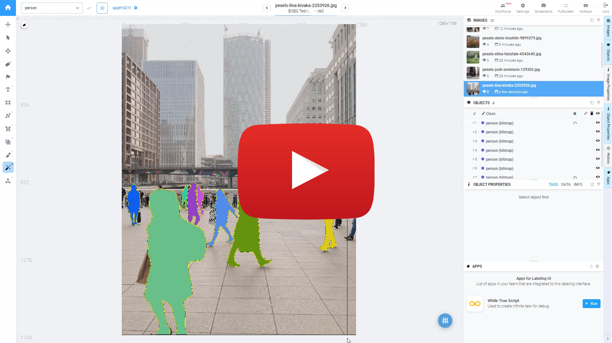 </a> 
        </td>
        <td>
           
        </td>
      </tr>
      <tr style="width: 100%">
        <td>
        <a data-key="sly-embeded-video-link" href="https://youtu.be/6wiKb-TX934" data-video-code="6wiKb-TX934">     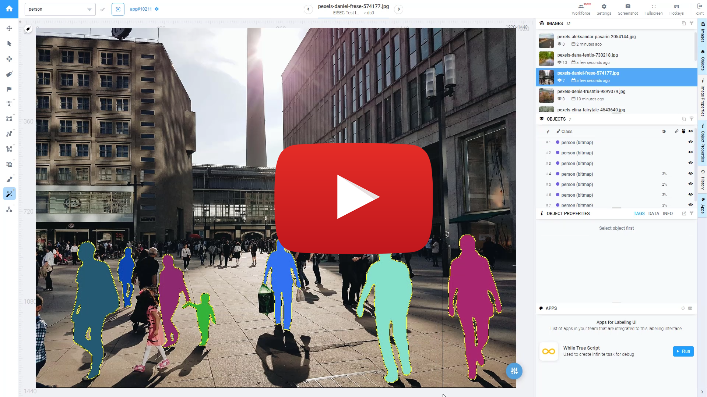 </a> 
        </td>
        <td>
          <a data-key="sly-embeded-video-link" href="https://youtu.be/n5qbdvO3fIw" data-video-code="n5qbdvO3fIw">   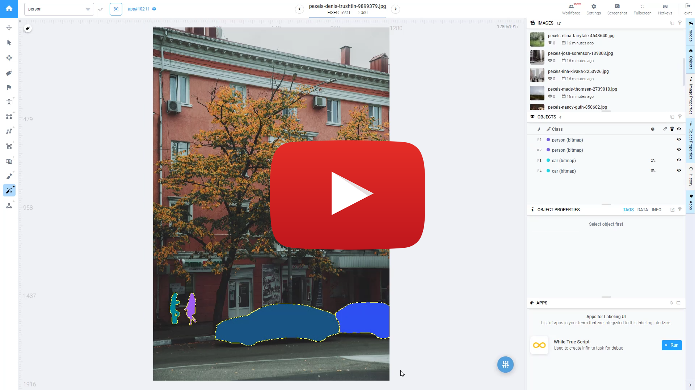 </a> 
        </td> 
      </tr>
    </table>

## Portrait
  <table>
    <tr style="width: 100%">
      <td>
        <a data-key="sly-embeded-video-link" href="https://youtu.be/LQ_oRNiqMzk" data-video-code="LQ_oRNiqMzk">     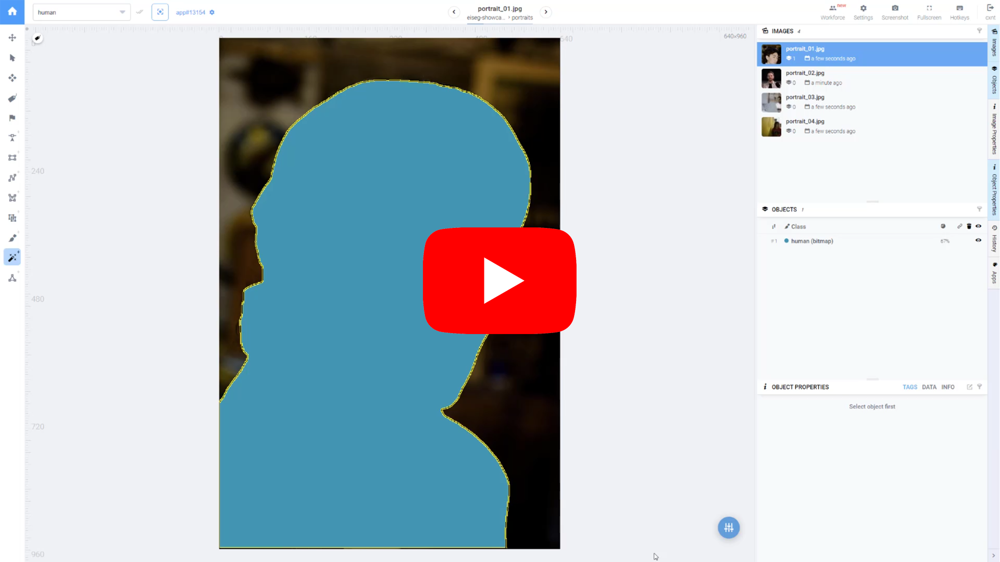 </a> 
      </td>
      <td>
        <a data-key="sly-embeded-video-link" href="https://youtu.be/IwNqvCaf3yM" data-video-code="IwNqvCaf3yM"> 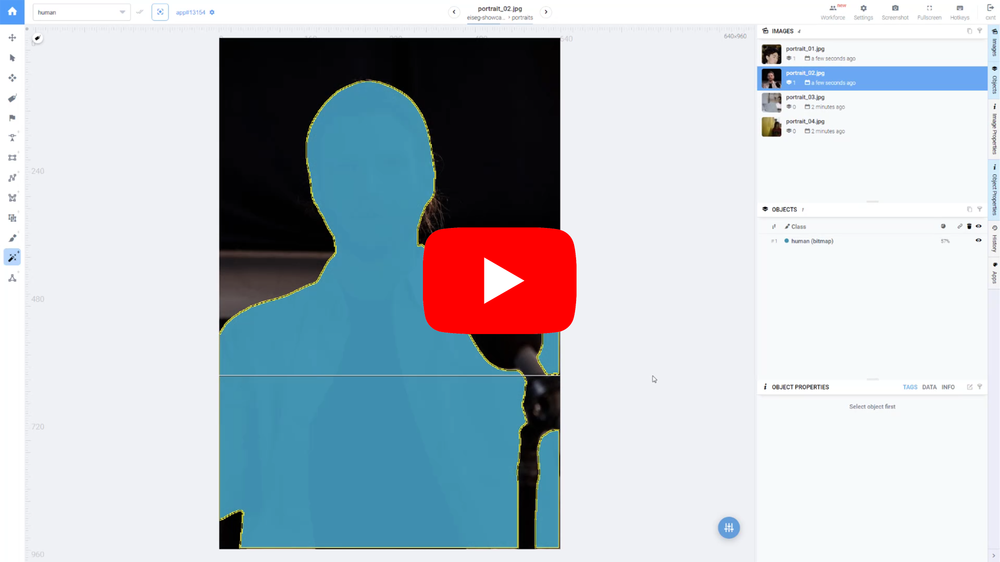 </a> 
      </td>
      </tr>
      <tr style="width: 100%">
        <td>
          <a data-key="sly-embeded-video-link" href="https://youtu.be/2VNNg3RcPT4" data-video-code="2VNNg3RcPT4">     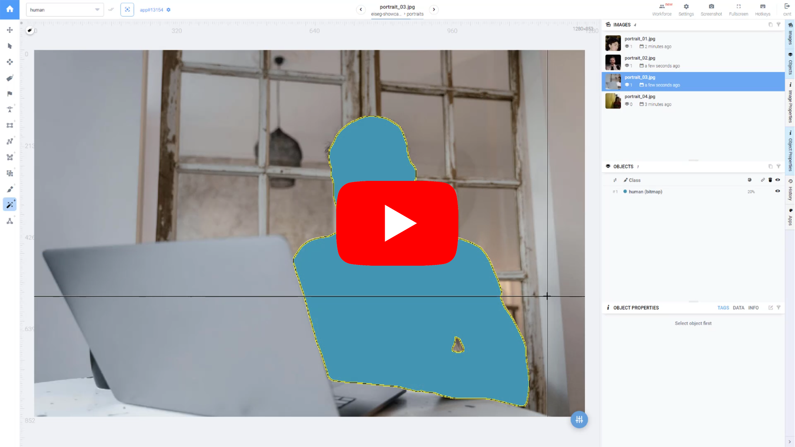 </a> 
        </td>
        <td>
          <a data-key="sly-embeded-video-link" href="https://youtu.be/er_NBHl8AAU" data-video-code="er_NBHl8AAU"> 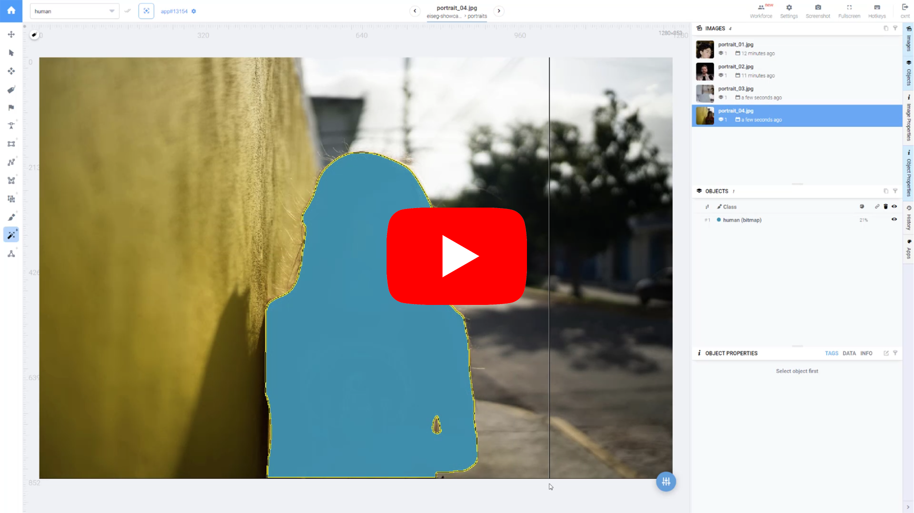 </a> 
        </td> 
      </tr>
    </table>

## Remote Sensing Building
  <table>
    <tr style="width: 100%">
      <td>
        <a data-key="sly-embeded-video-link" href="https://youtu.be/lV0Rglcov_Q" data-video-code="lV0Rglcov_Q">     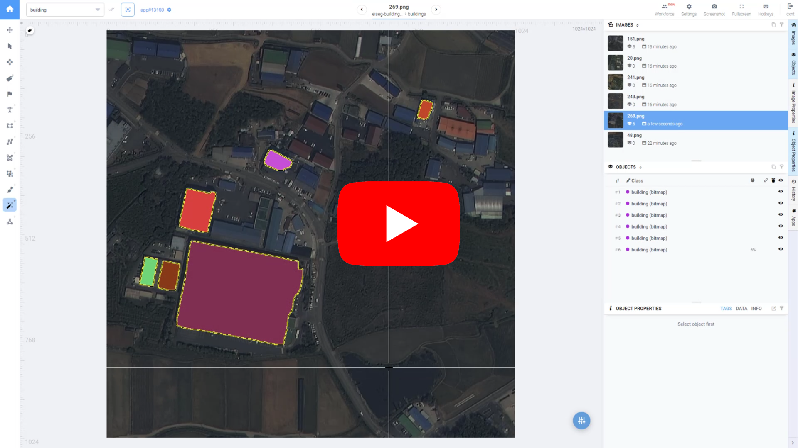 </a> 
      </td>
      <td>
        <a data-key="sly-embeded-video-link" href="https://youtu.be/wwuxlJahPe4" data-video-code="wwuxlJahPe4"> 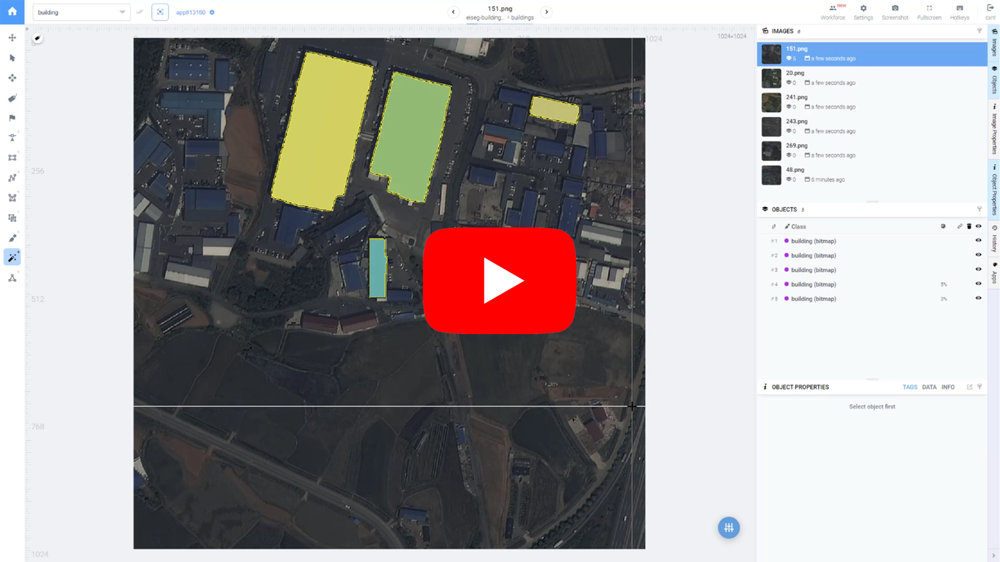 </a> 
      </td>
      </tr>
    </table>

## Liver
  <table>
    <tr style="width: 100%">
      <td>
        <a data-key="sly-embeded-video-link" href="https://youtu.be/UwfvpjUzGCc" data-video-code="UwfvpjUzGCc">     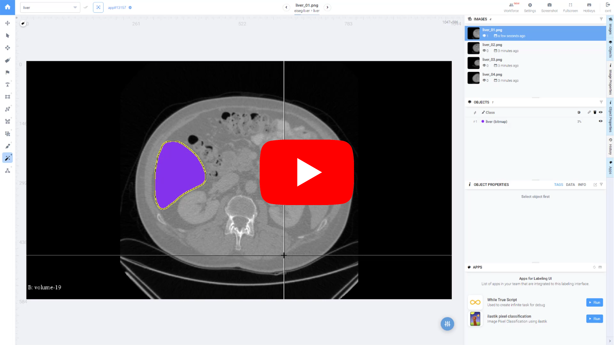 </a> 
      </td>
      <td>
        <a data-key="sly-embeded-video-link" href="https://youtu.be/d5zCWIyYCX0" data-video-code="d5zCWIyYCX0"> 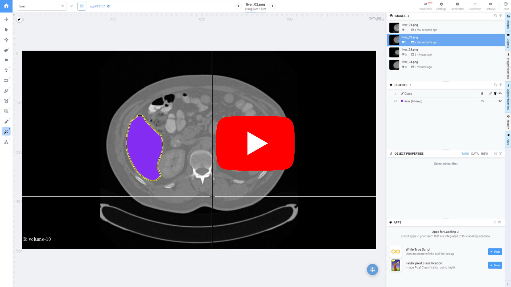 </a> 
      </td>
      </tr>
      <tr style="width: 100%">
        <td>
          <a data-key="sly-embeded-video-link" href="https://youtu.be/b7O1o4iVvIQ" data-video-code="b7O1o4iVvIQ">     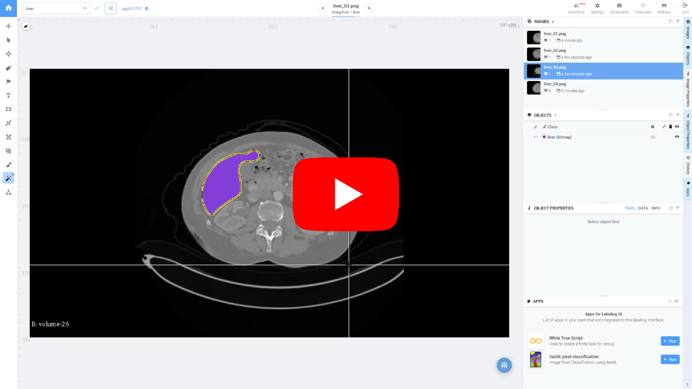 </a> 
        </td>
        <td>
          <a data-key="sly-embeded-video-link" href="https://youtu.be/-56XZifWtaw" data-video-code="-56XZifWtaw"> 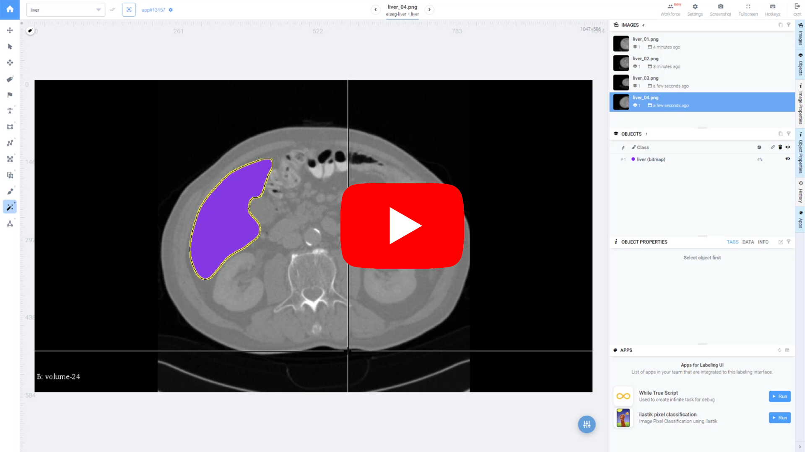 </a> 
        </td> 
      </tr>
    </table>

# Manual object correction

<a data-key="sly-embeded-video-link" href="https://youtu.be/6pMUHn0jNGE" data-video-code="6pMUHn0jNGE">
    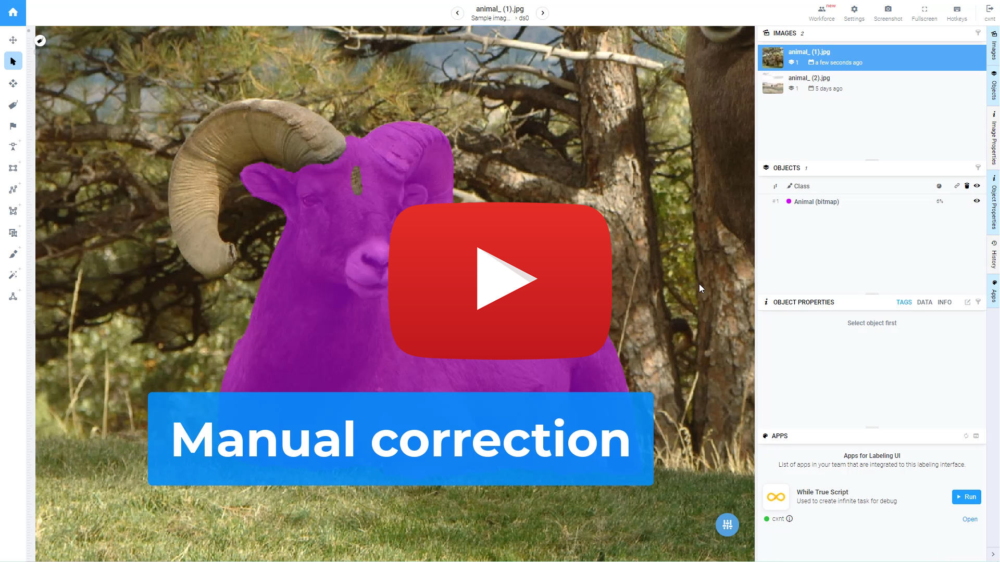
</a>

# Acknowledgment

This app is based on the great work by `PaddleSeg` Team ([paper](https://arxiv.org/pdf/2101.06175.pdf),  [github](https://github.com/PaddlePaddle/PaddleSeg)). 
